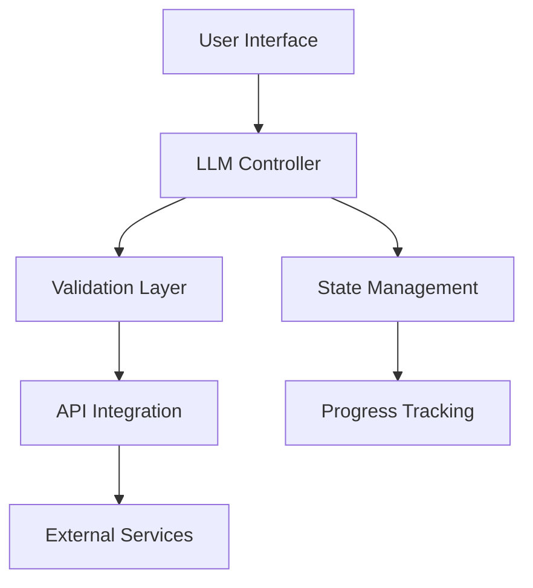
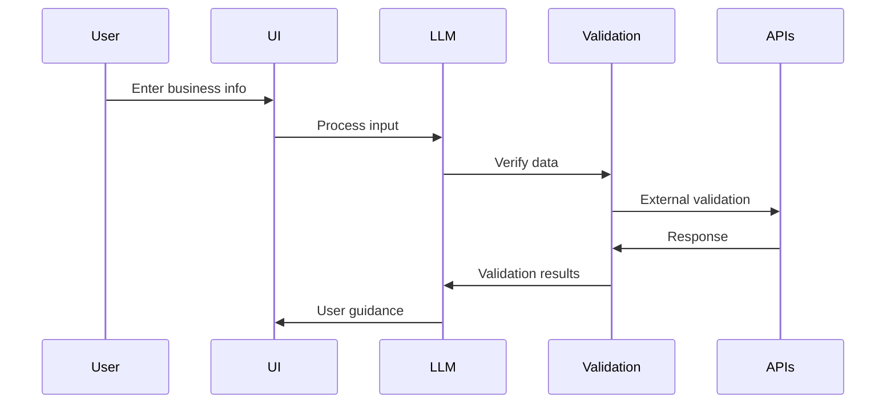

# Export Assessment Tool Implementation Guide

## Overview
This document outlines the technical requirements for implementing a guided, LLM-enhanced export assessment workflow within the existing TradeWizard platform.

## Phase 1: Business Identity & Initial Assessment

### Core Components

#### 1. Conversational Interface
- Implement chat-like interface with LLM integration
- Support both free text input and structured form elements
- Maintain conversation context throughout the session

#### 2. Business Verification System
- Real-time CIPC validation
- SARS compliance checking
- Contact detail verification
- Cross-reference validation system

### API Integration Requirements

```typescript
interface BusinessVerification {
  cipicValidation: {
    endpoint: string;
    validationRules: ValidationSchema;
    errorHandling: ErrorResponse;
  };
  sarsValidation: {
    endpoint: string;
    taxComplianceCheck: ComplianceSchema;
    responseHandling: ResponseType;
  };
  contactValidation: {
    rules: RegexPatterns;
    verificationMethods: VerificationTypes[];
  };
}
```

### Prompt Engineering Guidelines

#### System Prompt

```typescript
interface LLMPrompt {
  systemRole: string;
  context: {
    industryContext: string;
    validationResults: ValidationResponse;
    userInput: string;
  };
  responseFormat: {
    type: 'guidance' | 'verification' | 'followUp';
    structure: ResponseSchema;
  };
}
```

#### User Prompt

```typescript
interface FormState {
  businessInfo: BusinessInfo;
  validationStatus: ValidationStatus;
  llmContext: ConversationContext;
  userProgress: ProgressIndicators;
}
```

### Validation Rules

#### CIPC Validation



#### SARS Validation



#### Contact Validation


### Mockable API Service Provider

```typescript
interface ApiServiceProvider {
  mode: 'mock' | 'real';
  getImplementation(): ServiceImplementation;
}

class MockableCIPCService implements ApiServiceProvider {
  constructor(mode: 'mock' | 'real' = 'mock') {
    this.mode = mode;
  }
  
  getImplementation() {
    return this.mode === 'mock' ? new MockCIPCService() : new RealCIPCService();
  }
  
  async verifyCompany(registrationNumber: string): Promise<VerificationResult> {
    return this.getImplementation().verifyCompany(registrationNumber);
  }
}
```

### State Management

```typescript
interface AssessmentState {
  businessInfo: BusinessInfo;
  validationStatus: ValidationStatus;
  llmContext: ConversationContext;
  userProgress: ProgressIndicators;
}

interface FeatureFlags {
  useCIPCRealAPI: boolean;
  useSARSRealAPI: boolean;
  useWebScrapingRealAPI: boolean;
}

const getFeatureFlags = (environment: string): FeatureFlags => {
  switch(environment) {
    case 'production':
      return {
        useCIPCRealAPI: true,
        useSARSRealAPI: true,
        useWebScrapingRealAPI: true
      };
    case 'staging':
      return {
        useCIPCRealAPI: true,
        useSARSRealAPI: false,
        useWebScrapingRealAPI: false
      };
    default:
      return {
        useCIPCRealAPI: false,
        useSARSRealAPI: false,
        useWebScrapingRealAPI: false
      };
  }
};
```

### Progress Tracking

```typescript
interface Progress {
  currentStep: number;
  totalSteps: number;
  completedSteps: number;
  isComplete: boolean;
}
```

### Error Handling

```typescript
interface BusinessProfileViewModel {
  companyInfo: {
    name: string;
    founded: string;
    location: string;
    size: string;
  };
  team: TeamMember[];
  products: Product[];
  marketPresence: MarketLocation[];
  performance: PerformanceMetric[];
}

const mockCIPCResponses = {
  validCompany: {
    verified: true,
    companyName: "Global Fresh SA Pty LTD",
    registrationDate: "2018-03-15",
    registrationNumber: "2018/123456/07",
    status: "Active",
    entityType: "PTY LTD",
    directors: [
      {
        name: "Sean King",
        id: "7001015009087",
        role: "Director",
        appointmentDate: "2018-03-15"
      },
      {
        name: "Thandi Nkosi",
        id: "7502100112083",
        role: "Director",
        appointmentDate: "2018-03-15"
      }
    ],
    registeredAddress: "15 Industrial Avenue, Stellenbosch, Western Cape, 7600"
  },
  invalidCompany: {
    verified: false,
    errors: [
      {
        code: "COMPANY_NOT_FOUND",
        message: "No company found with the specified registration number"
      }
    ]
  },
  serviceError: {
    error: true,
    code: 503,
    message: "Service temporarily unavailable"
  }
};
```
